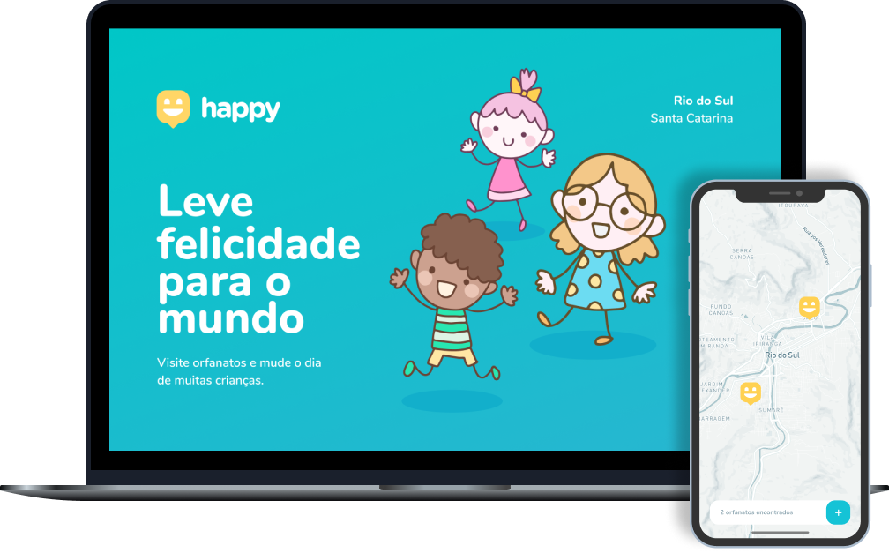

<h1 align="center">
    
</h1>

  <a href="#-projeto">Project</a>&nbsp;&nbsp;&nbsp;|&nbsp;&nbsp;&nbsp;
  <a href="#-tecnologias">Technologies</a>&nbsp;&nbsp;&nbsp;|&nbsp;&nbsp;&nbsp;
  <a href="#-layout">Layout</a>

 

  

 

  

## 💻 Project

Happy is an app that connects people to institutional homes (orphanages) to make the day of many children happier 💜 
The project is part of Next Level Week #03 (NLW), a bootcamp by [Rocketseat](https://rocketseat.com.br/).

You can view the site in: 
[https://xenodochial-bhaskara-1e7409.netlify.app/](https://xenodochial-bhaskara-1e7409.netlify.app/)

The other parts of the project are available in:
- [happy-server](https://github.com/jeffersongouveia/happy-server)
- [happy-mobile](https://github.com/jeffersongouveia/happy-mobile)

## 🚀 Technologies

This project was developed using the following techs:

- [Node.js](https://nodejs.org/en/)
- [React](https://reactjs.org)
- [React Native](https://facebook.github.io/react-native/)
- [Expo](https://expo.io/)
- [TypeScript](https://www.typescriptlang.org/)

## 🔖 Layout

In the links below you will find the layout of the web project and the mobile.
The credits for the layout goes all to [Rocketseat](https://rocketseat.com.br/) team.

- [Layout Web](https://www.figma.com/file/mDEbnoojksG4w8sOxmudh3/Happy-Web)
- [Layout Mobile](https://www.figma.com/file/X27FfVxAgy9f5IFa7ONlph/Happy-Mobile)
